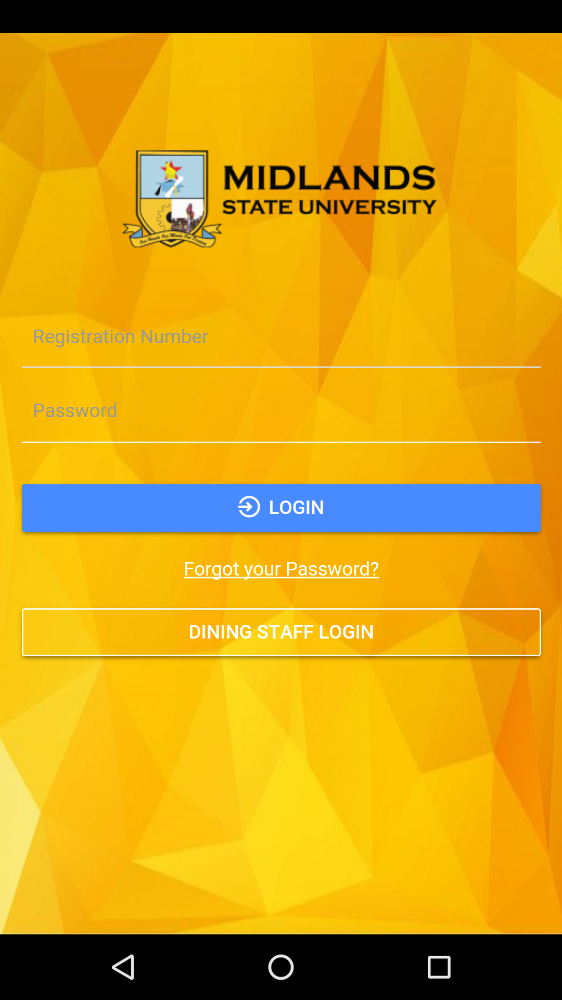
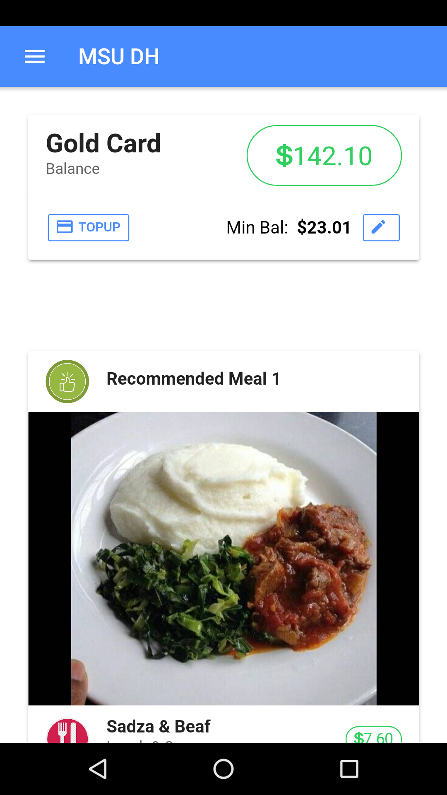
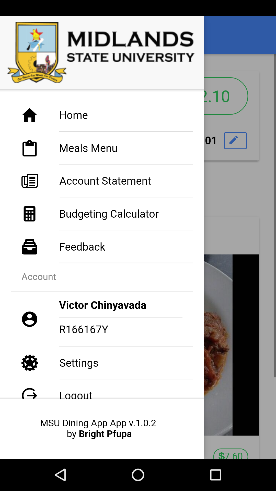
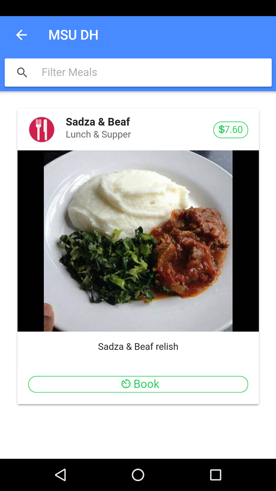
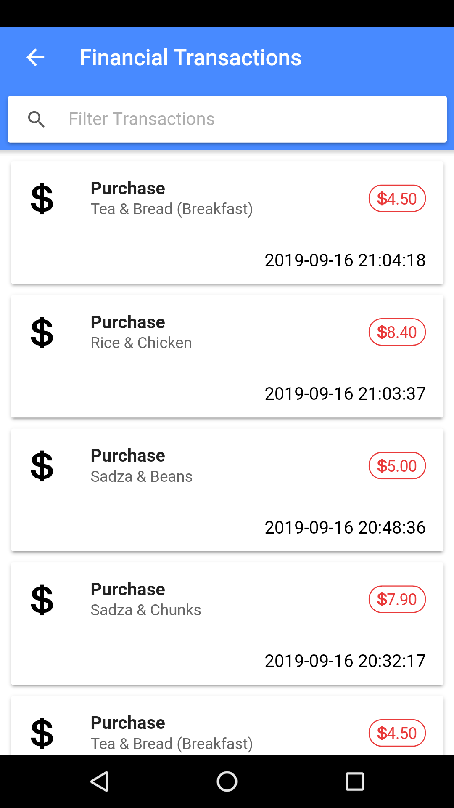
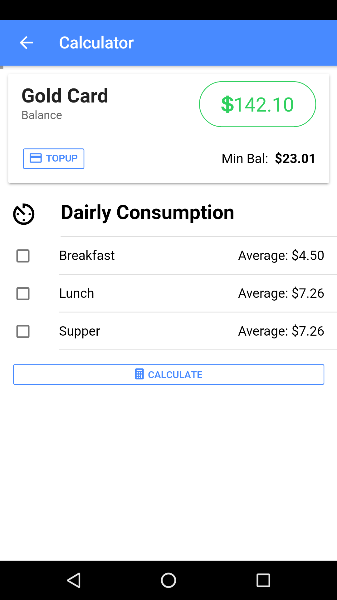
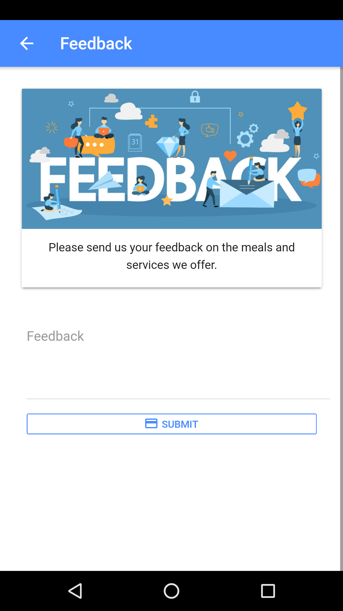
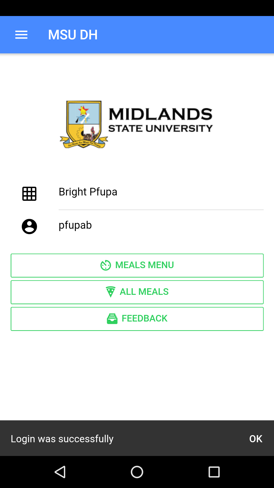
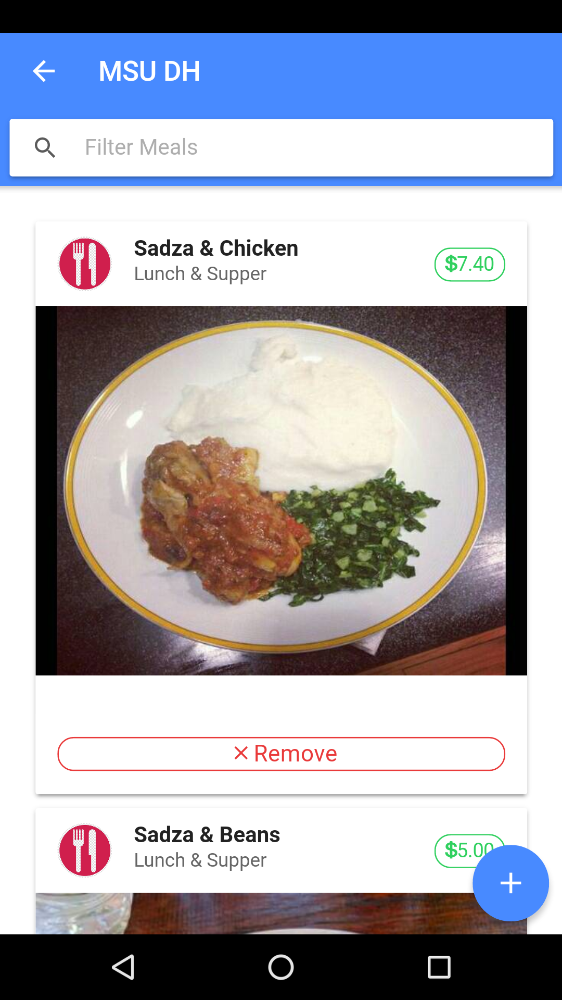
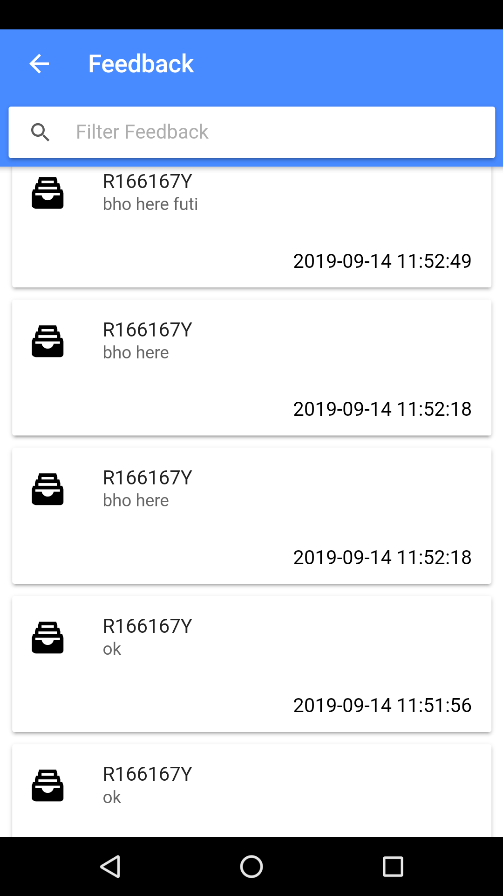

# University-Dining-App
Android app that allows university students to view meal menu, topup their dining account, forecast their consumption and recommend meals on rotational basis.

## Screenshots

## Installations
### Prerequisites
1. PHP Server 7+
2. MySQL database server
3. NodeJS
4. Android SDKs

### Stages
1. npm i -g ionic
2. npm i -g cordova
3. Open project folder via console and run
npm i
4. extract the server_side_api.zip and add to web root
5. create database named hackathorn and import hackathon.sql
6. in project path run
ionic serve
7. when the login screen appears, slide from left to right and configure server ip e.g http://localhost/msudh/
